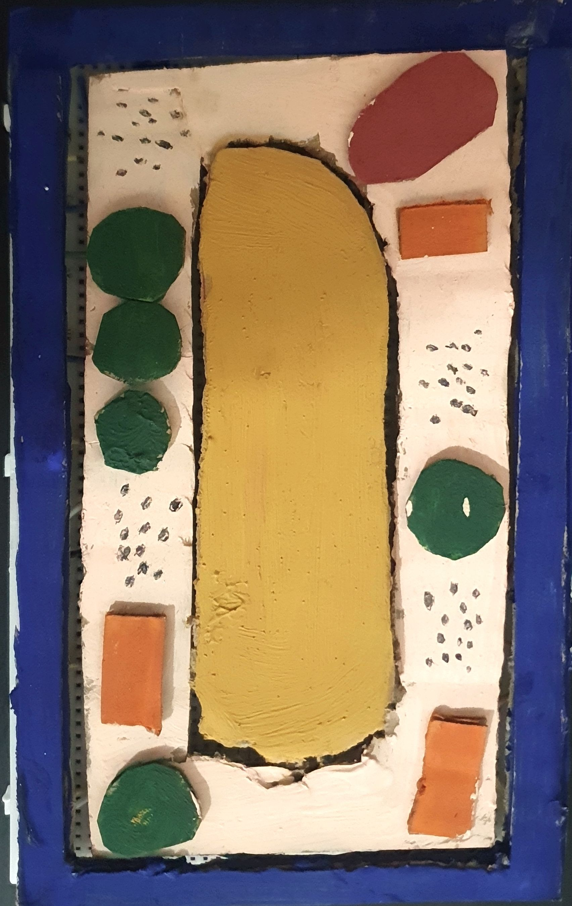
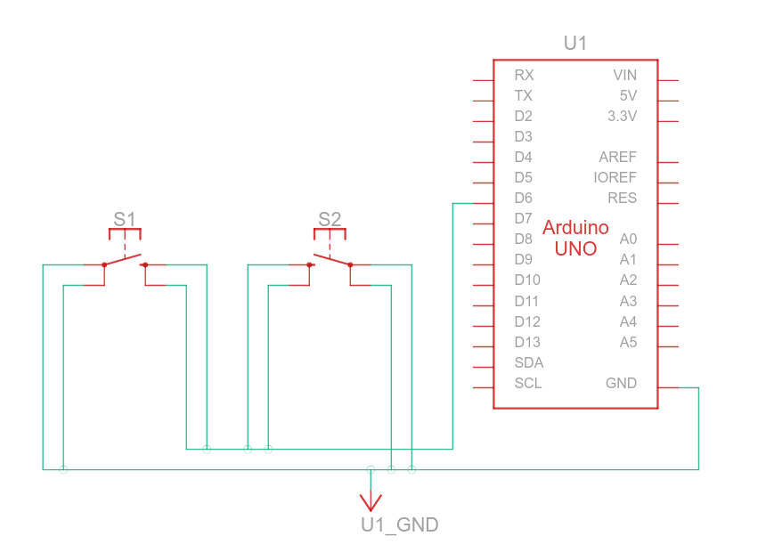

# An Interactive Plant Cell Science Project Based Off an Arduino

This project is a science project I made. It is an interactive model of a plant cell. The arduino I used is the original R3 uno, but any other one may work as well. The way it works is that when a button is pressed, information is sent to a 4x20 LCD screen. If there are multiple of the same type of part of the plant cell, buttons can be linked together. To select between the cell wall and cell membrane, there is a knob and a button. turn the knob, then press the cell wall/membrane button and then press the selection button.

## Exterior
I used superglue to stick cardboard onto the buttons, shown in the picture below:

## Wiring
the vaccuole is wired to pin 11
the mitochondria is wired to pin 2
the chloroplast is wired to pin 10
the nucleus is wired to pin 9
the cytoplasm is wired to pin 12
the selector button is wired to pin 6
the knob is wired to analog input A0
the cell wall/membrane is wired to pin 7

you can string buttons together, like this:
 

